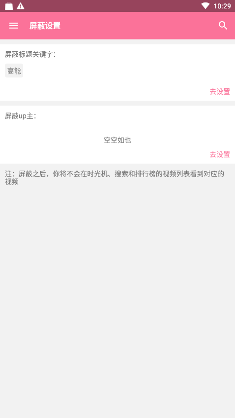
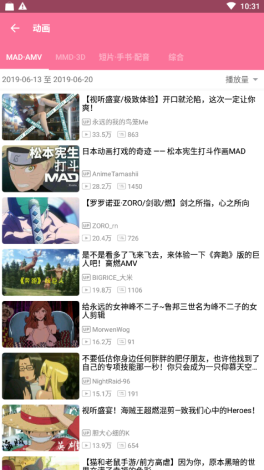
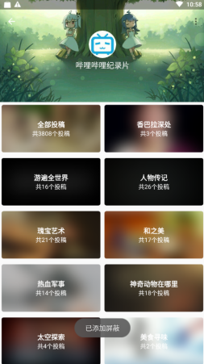
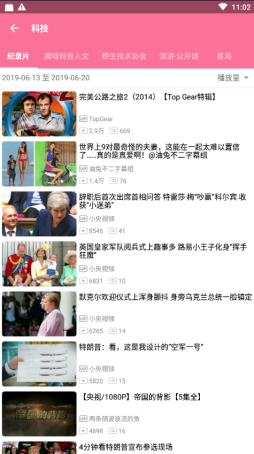

2.1及以上版本已将入口更改为“设置”->“屏蔽设置”，屏蔽功能仅对时光机分区视频列表及搜索列表生效

#### 1、屏蔽标题关键字

设置屏蔽关键字，如“高能”

设置之后，将不会在在视频列表看到对应视频，如下（左:屏蔽前，右:屏蔽后）

#### 2、屏蔽up主

遇到不喜欢的up主，就屏蔽ta，可以在up详情页，点击右上角三个点的按钮，即可屏蔽该up主

设置之后，将不会在在视频列表看到对应视频，如下（左:屏蔽前，右:屏蔽后）

*注：

1：以上屏蔽内容非个人立场，仅示例用

2：屏蔽仅对时光机、搜索和排行榜的视频列表有效

