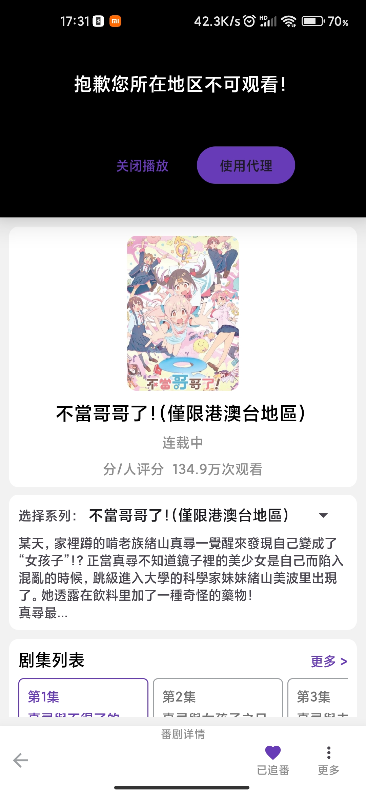
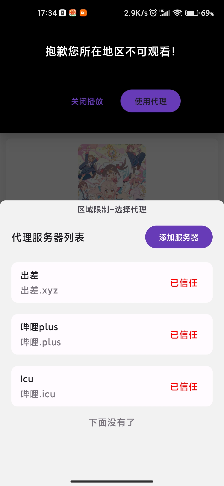
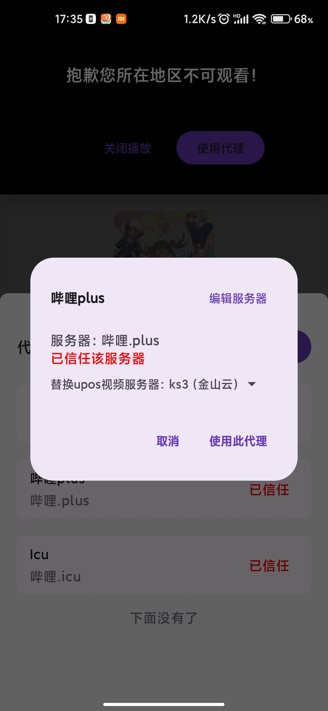
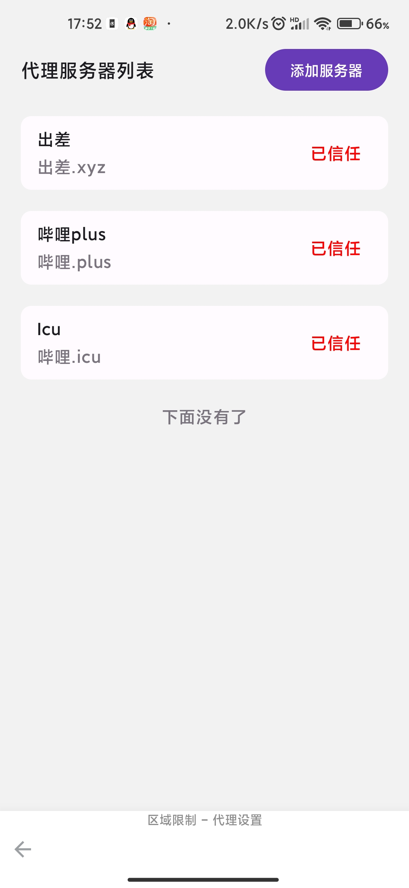
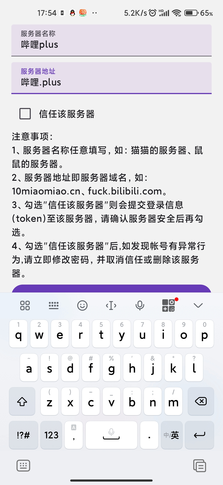
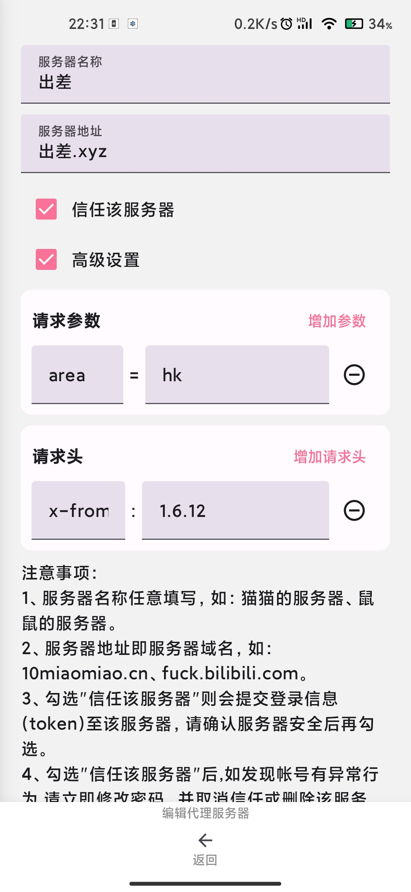

#### 1、如何使用

（1）当播放器提示“抱歉你所在的地区不可观看时”，方可使用代理

（2）点击“使用代理“进入“代理服务器选择页面“，如无添加服务器可按照第2步(添加代理服务器)添加。

（3）在代理服务器列表选择你的服务器。

（4）点击”使用此代理“即可使用。

关于“替换upos选项”：

港澳台的视频解析出来的视频文件的域名是upos-hz-mirrorakam.akamaized.net，这家CDN貌似没有国内的节点，大多数情况下这个域名都会指向美国的IP，速度特别慢。替换upos服务器，使用国内的视频服务器，能够缓解卡顿的问题。

#### 2、添加代理服务器

（1）进入代理服务器设置页面，页面路径：首页->设置->播放设置->区域限制设置

（2）点击“添加服务器“，输入服务器信息（可参考第3步公共解析服务器参考）

（3）服务器名称自取任定，服务器地址仅填写服务器域名，不需要前缀http或https，填写完成后，点击“添加服务器”即可。

关于“信任该服务器选项”：

勾选该选项后，使用代理服务器获取视频播放地址时，bilimiao会将你的B站账户登录信息（如token等）提交给代理服务器，请仔细甄别后才可勾选。勾选后，如发现帐号有异常行为,请立即修改密码，并取消信任或删除该服务器。

不勾选该选项，则不会提交你的B站账户登录信息（如token等）提交给代理服务器，相当于不登陆使用。

### 3、高级设置

部分服务器可能需要添加额外的请求参数或请求头才能使用

如果使用下面的公共解析服务器，推荐增加请求参数area和请求头x-from-biliroaming

请求参数area参考值：`cn`中国大陆；`hk`香港；`tw`台湾；`th`泰国、东南亚；

请求头x-from-biliroaming参考值：1.6.12

#### 4、公共解析服务器参考：

[https://github.com/yujincheng08/BiliRoaming/wiki/%E5%85%AC%E5%85%B1%E8%A7%A3%E6%9E%90%E6%9C%8D%E5%8A%A1%E5%99%A8#%E6%9C%8D%E5%8A%A1%E5%99%A8%E7%8A%B6%E6%80%81](https://github.com/yujincheng08/BiliRoaming/wiki/%E5%85%AC%E5%85%B1%E8%A7%A3%E6%9E%90%E6%9C%8D%E5%8A%A1%E5%99%A8#%E6%9C%8D%E5%8A%A1%E5%99%A8%E5%88%97%E8%A1%A8)

|提供者|地区|服务器|捐赠|
|-|-|-|-|
|[@Kimmy_XYC](https://t.me/Kimmy_XYC)|所有|- 哔哩.plus
 - api.mahiron.moe|[https://afdian.net/@KimmyXYC](https://afdian.net/@KimmyXYC)|
|[@LiangBurs](https://t.me/LiangBurs_ServerLogs)|所有|- api.mahiro-kawaii.me
 - cherry.icu.cnmobile.link|[https://afdian.net/a/LiangBurs](https://afdian.net/a/LiangBurs)|
|[@heinu123](https://t.me/wtdnwbzda)|所有|- api.rnmmihoyo.cc
 - api.mihoyo.buzz|[https://www.heinu.cc/donate](https://www.heinu.cc/donate)|
|[@liuran001](https://t.me/huobi_robot)|所有|- bili.obdo.cc|[https://afdian.net/a/BDovo](https://afdian.net/a/BDovo)|
|[@Sakura_Akino](https://t.me/Sakura_Akino)|所有 *仅带会员*|- api.xn--3bs5b681glo2bpsat27a.com
 - api.qiu.moe|[https://afdian.net/@SakuraAkino](https://afdian.net/@SakuraAkino)|
|[@qi_mo_bot](https://t.me/qi_mo_bot)|所有 *仅带会员*|- 哔哩.icu|[https://哔哩.icu/hb.html](https://xn--2vrub.icu/hb.html)|
|[@NC-Raws](https://t.me/nc_raws)|所有|- bstar.kirara-fantasia.moe|[https://api.10ms.net/about.html](https://api.10ms.net/about.html)|
|[@azurstar](https://github.com/azurstar)|所有|- 伊蕾娜.我爱你|[https://伊蕾娜.我爱你/donate](https://xn--qoqt3y678a.xn--6qq986b3xl/donate)|
|[@atri828](https://t.me/atri828)|所有|- atri.ink|[https://afdian.net/@atri0828](https://afdian.net/@atri0828)|
|[@P CH](https://t.me/chenzerocheng)|所有|- 嘉然批.发超市.icu
 - 万人骑.pch.pub|[https://嘉然批.发超市.icu/donate](https://xn--w4r620anpl.xn--oor00vs23b.icu/donate)|
|[@kotori tan](https://t.me/Reze_bomb)|所有|- melusine.moe|[https://afdian.net/@ktrtan](https://afdian.net/@ktrtan)|
|[@Kana](https://t.me/KanaMiao)|所有|- bili.rikko.moe|[https://afdian.net/a/KanaMiao](https://afdian.net/a/KanaMiao)|
|[@Suysker](mailto:mail@suysker.xyz)|所有|- bilibili.suysker.xyz|[https://afdian.net/a/suysker](https://afdian.net/a/suysker)|
|[@xcnya](https://t.me/xcnya)|所有|- bili.xcnya.cn|[https://blog.xcnya.cn/donate.html](https://blog.xcnya.cn/donate.html)|
|[@xifeng0](https://github.com/yujincheng08/BiliRoaming/wiki/t.me/xifeng040)|港澳台、东南亚|- hk.xifeng.cf|[https://afdian.net/a/xifeng04](https://afdian.net/a/xifeng04)|
|[@GamerNoTitle](https://github.com/GamerNoTitle)|东南亚|- sea.biliroaming.bili33.top|[https://bili33.top/sponsors/](https://bili33.top/sponsors/)|
|[@GamerNoTitle](https://github.com/GamerNoTitle)|港澳|- hk.biliroaming.bili33.top|[https://bili33.top/sponsors/](https://bili33.top/sponsors/)|
|[@weifenghexu](https://github.com/weifenghexu)|港澳、东南亚|- api.etocs.tk|[https://afdian.net/a/etocs](https://afdian.net/a/etocs)|
|[@JSTks24](https://t.me/JSTks24)|港澳台、中国大陆|- cc.hmountainln.cn|[https://afdian.net/a/blroaming](https://afdian.net/a/blroaming)|
|[@sizxiwu](https://t.me/mcaacxxx)|港澳台|- api.bilibili.cz|[https://afdian.net/a/paimeng123](https://afdian.net/a/paimeng123)|
|[@Alloy81284](https://t.me/KarmaSakura)|港澳台|- biliproxy.lingft.tk|[https://afdian.net/@AlloySakura](https://afdian.net/@AlloySakura)|
|[@CodePwn2021](https://t.me/CodePwn_bot)|港澳、中国大陆|- bili.ox19.top|[https://afdian.net/a/oxygenx19](https://afdian.net/a/oxygenx19)|
|[@manhol](https://t.me/manhol)|台湾、中国大陆|- 出差.xyz|[https://出差.xyz/donate.html](https://xn--79q440a.xyz/donate.html)|
|[@M1saka10010](https://github.com/M1saka10010)|港澳台、中国大陆|- bili.lli.cx
 - xn--6iq3kpqgx685at9rw0i59xsk7d.work|[https://afdian.net/@BiliM1saka](https://afdian.net/@BiliM1saka)|
|[@hanasaki-misaki](https://lolicon.team/about)|港澳台|- 漩涡.猫猫.top|[https://afdian.net/@miraipip](https://afdian.net/@miraipip)|
|[@XiaoMengXin](https://t.me/XiaoMengXin)|港澳|- xn--n4yr07d.rip|[https://afdian.net/@XiaoMengXinX](https://afdian.net/@XiaoMengXinX)|
|[@Ms_Aves](https://t.me/Ms_Aves)|港澳|- 宣传就跑.top|[https://afdian.net/@Ms_Aves](https://afdian.net/@Ms_Aves)|
|[@aedelnz](https://github.com/aedelnz)|港澳台|- bili.jixiejidiguan.eu.org|[https://afdian.net/a/JIXIEJIDIGUAN](https://afdian.net/a/JIXIEJIDIGUAN)|
|[@hyb-oyqq](https://t.me/ouyangqiqiqi)|港澳台|- bili.hybgzs.com|[https://afdian.net/a/ouyangqiqi](https://afdian.net/a/ouyangqiqi)|
|[@ColdThunder11](https://t.me/ColdThunder11)|所有|- xn--yetw86k.xn--6iq3kpqgxt31fvs6c4pp.icu||
|[@Islantay](https://t.me/Islantay)|所有|- deep-dark-fantasy.chiya.club
 - api.bilibili.sb||
|[@guagua_ya66](mailto:beiguagua@gmail.com)|所有|- bili.baba.plus||
|[@cxw620](https://message.bilibili.com/#/whisper/mid2038842528)|所有|- bili.api.acfun.win||
|[@ayasa0520](mailto:ayasa0520@gmail.com)|所有|- bilibili.lianju.ren||
|[@jaysherlock](https://t.me/daluoda)|所有|- 姬坂乃爱.我爱你||
|[@david082321](https://github.com/david082321)|台湾、东南亚|- bilibili.page||
|[@Artemis Fowl](https://t.me/Artemis_Fowl1)|港澳、台湾|- 泰区评论会寄.lushx.top||
|[@LIGHT-Mus](https://github.com/LIGHT-Mus)|港澳|- bilisb.ltmsc.top||

