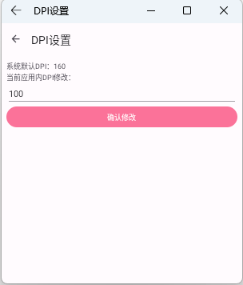
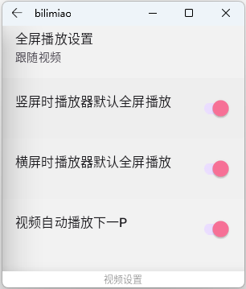

此App优先适配手机和平板，如果你需要手表上使用此APP，建议进行以下设置：

#### 1、DPI设置，手表上使用可能会出现文字过大的情况，这时候可以调整应用内DIP，以展示最佳界面

设置路径：进入设置页面→视频设置→应用内DPI设置

DPI越大，文字越大，反之越小

#### 2、设置默认全屏播放，关闭小屏播放

设置路径：进入设置页面→视频设置→打开默认全屏播放

横屏时播放器默认全屏播放和竖屏时播放器默认全屏播放和均打开

