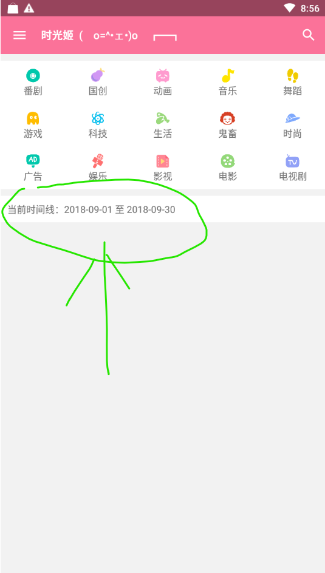
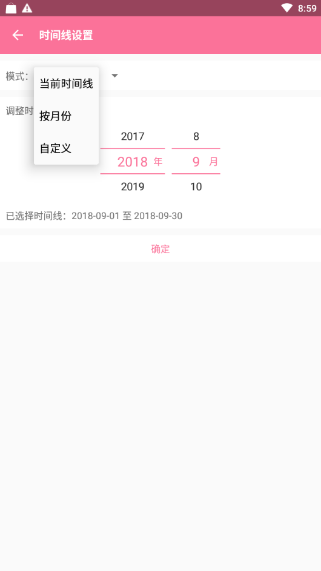

功能说明：设置时间范围，可以查看该时间范围的热门视频，目前仅对分区列表生效

#### 1、设置时间

首页时间线显示部分点击进入设置时间范围

进入时间设置之后，有三种模式可以选择

[1] 当前时间，查看当前时间范围的热门视频

[2] 按月份，查看所选月份的热门视频

[3] 自定义，查看自定义时间范围的热门视频，时间间隔最多30天

#### 2、查看视频列表

设置时间后，在首页选择对应分区，即可查看所选时间范围的热门视频，以2013年10月1日至2013年10月31日的动画分区MAD·AMV子分区为例

